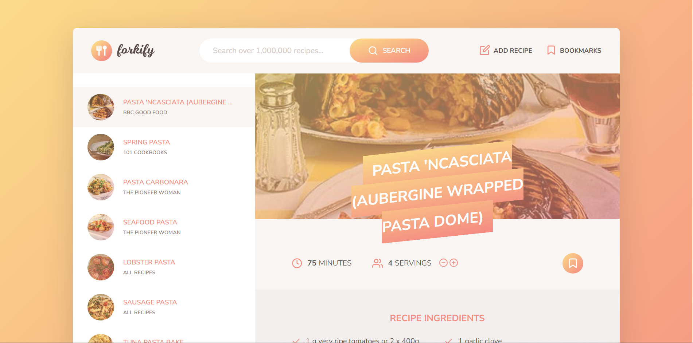
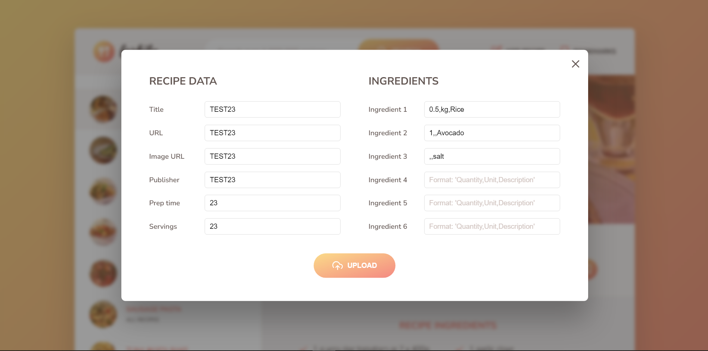
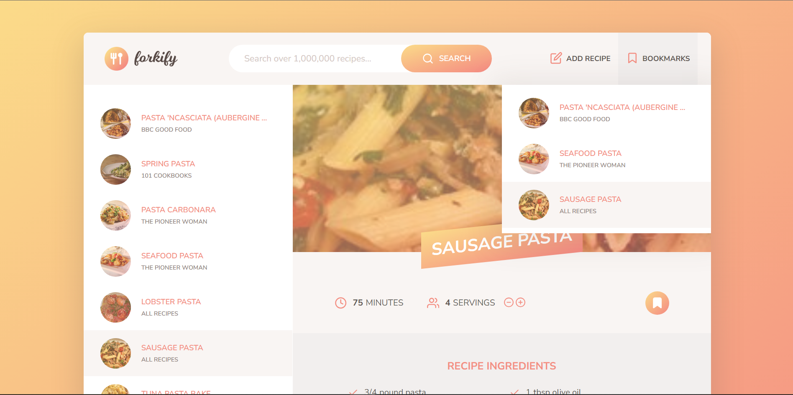

# Forkify Project

### Live Site URL

Recipe application for searching and creating recipes.

## Table of contents

- [Overview](#overview)
  - [The challenge](#the-challenge)
  - [Screenshot](#screenshot)
  - [Links](#links)
- [My process](#my-process)
  - [Built with](#built-with)
  - [What I learned](#what-i-learned)
- [Author](#author)
- [Acknowledgments](#acknowledgments)

## Overview

### The challenge

Users should be able to:

- Search recipes
- Bookmark recipes
- Create recipes
- Personalize the amount of servings

### Screenshot

### Demo

### Links

- Live Site URL: [https://forkify-good-food-recipes.netlify.app/](https://forkify-good-food-recipes.netlify.app/)

## My process

This is the last and the biggest project I made through a course. It was very challenging especially the part where you must understand how every data flows between each modules and to properly implement the MVC (Model-View-Controller) architecture. Overall, I had a lot of fun and learned a lot of things throughout the development.

### Built with

- Semantic HTML5
- CSS3
- JavaScript
- Sass

### What I learned

I learned in this project is that understanding the overall structure and functionality of your code is very important and in the development stage, we must always test out every feature that we added before adding more. In addition, we must think out of the box, be creative, and have fun while developing projects.

## Author

- GitHub - [quielLovesLasagna](https://github.com/quielLovesLasagna)

## Acknowledgements

I would like to thank [Jonas Schmedtmann](https://twitter.com/jonasschmedtman) and his team for teaching and helping me and everyone else throughout the course.
